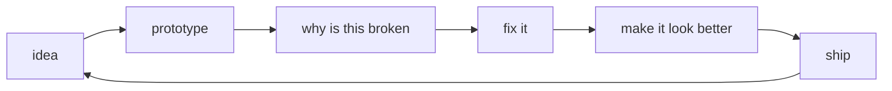

<div align="center">

# Sarasitha Galagama

**I build useful things on the internet.**  
Sometimes with data. Sometimes with code. Sometimes because the UI annoyed me.

[website](https://www.sarasitha.me) · [projects](https://www.sarasitha.me/projects) · [github](https://github.com/sarasithagalagama) · [email](mailto:sarasithagalagama@gmail.com)

</div>

---

```txt
sarasitha@github:~$ whoami

information systems engineering student
developer + data enthusiast + designer
currently turning random ideas into repositories
```

I'm a third-year **Information Systems Engineering** undergraduate at SLIIT.

Most of the things I build live somewhere between **software, data, machine learning and design**.

I enjoy taking an idea from:

`"this could be useful"`

to

`"okay why does this actually work"`

and eventually to

`git push origin main`

---

## things I've been building

| | Project | What's inside |
|---|---|---|
| **01** | [DTD Motors](https://github.com/sarasithagalagama/dtdmotors) | Vehicle sourcing & export platform built with React, TypeScript and Tailwind |
| **02** | [Methsara Publications](https://github.com/sarasithagalagama/Methsara-Publications) | Full-stack bookstore with orders, inventory, authentication and admin workflows |
| **03** | [LoanWise LK](https://github.com/sarasithagalagama/LoanWise-LK) | Loan eligibility prediction, risk classification and analytics |
| **04** | [Customer Behavior Analysis](https://github.com/sarasithagalagama/customer-behavior-data-analyst-SQL-Python-PowerBI) | SQL + Python + Power BI analysis of customer purchasing behaviour |
| **05** | [Sales Analytics Pipeline](https://github.com/sarasithagalagama/Sales-Analytics-Pipeline) | PostgreSQL, dbt and Airflow analytics pipeline |
| **06** | [The P.A.T.H.](https://github.com/sarasithagalagama/The_P.A.T.H) | Trilingual political alignment application with scoring and visualization |
| **07** | [PotatoPulse](https://github.com/sarasithagalagama/PotatoPulse) | CNN-powered potato disease detection because apparently potatoes needed AI too |
| **08** | [HueFlow](https://github.com/sarasithagalagama/Hueflow-Accessible-Brand-Color-Studio) | Accessible brand colour studio and contrast toolkit |

There's more hiding in my repositories.

---

## my usual toolbox

<div align="center">


</div>

---

## the pattern



Pretty accurate.

---

## somewhere between

```text
data analysis        ████████░░
full-stack dev       █████████░
machine learning     ███████░░░
UI / UX              ████████░░
sleep schedule       ██░░░░░░░░
```

I like projects where I can work across more than one layer — analyze the data, build the backend, create the interface and then spend an unreasonable amount of time making the spacing look right.

---

## a few more experiments

**[Sales Dashboard](https://github.com/sarasithagalagama/Sales-Dashboard)**  
Power BI sales and performance analytics.

**[Sri Lanka Weather Dashboard](https://github.com/sarasithagalagama/Sri-Lanka-Weather-Dashboard)**  
Weather and air-quality data transformed into an interactive BI dashboard.

**[Fake News Classifier](https://github.com/sarasithagalagama/fake-news-classifier)**  
NLP text classification using TF-IDF and Logistic Regression.

**[Explore Sri Lanka With Us](https://github.com/sarasithagalagama/explore_srilanka_with_us)**  
A full-stack travel platform built around Sri Lankan destinations.

---

## github, according to github

<div align="center">


</div>

---

<div align="center">

### still building.

Not everything needs to become a startup.  
Sometimes making something cool is enough.

**[sarasitha.me](https://www.sarasitha.me)**

</div>
